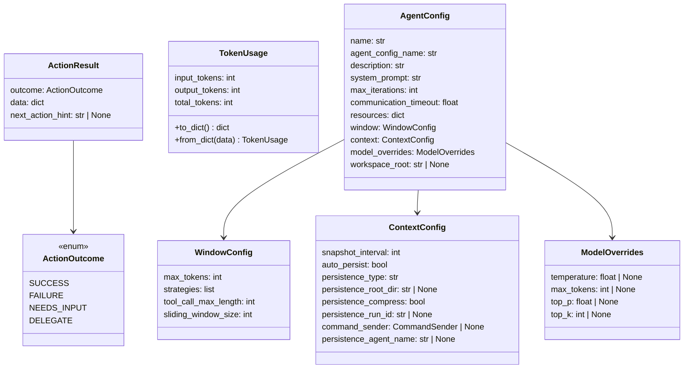
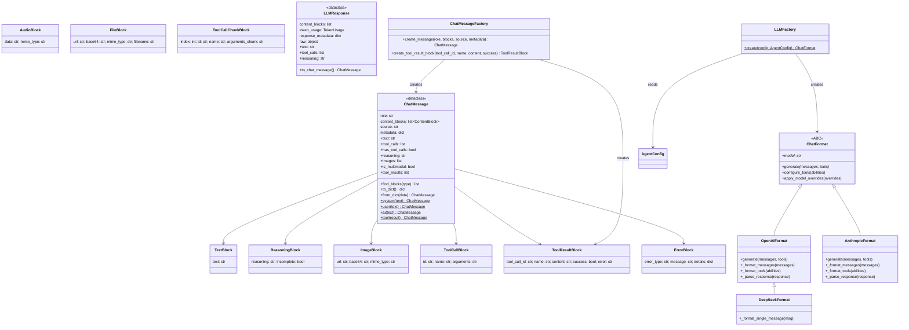
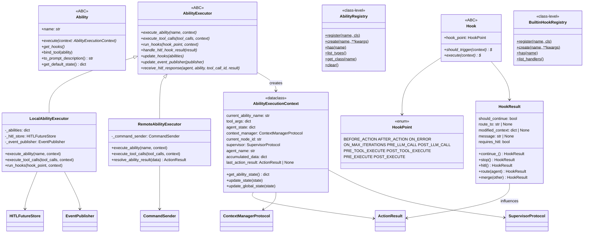
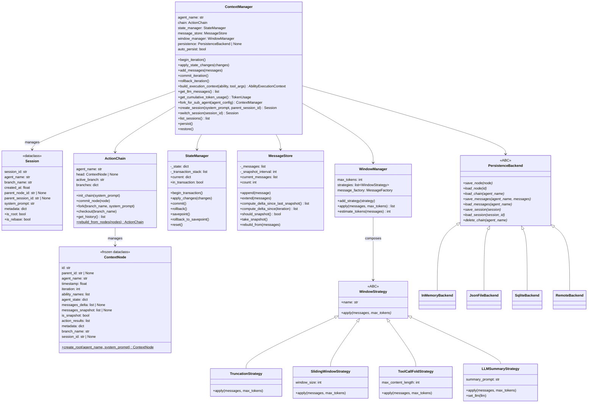
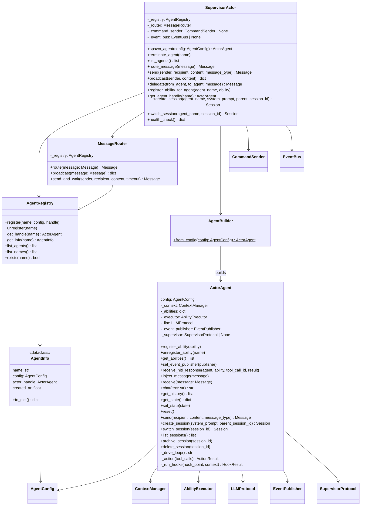
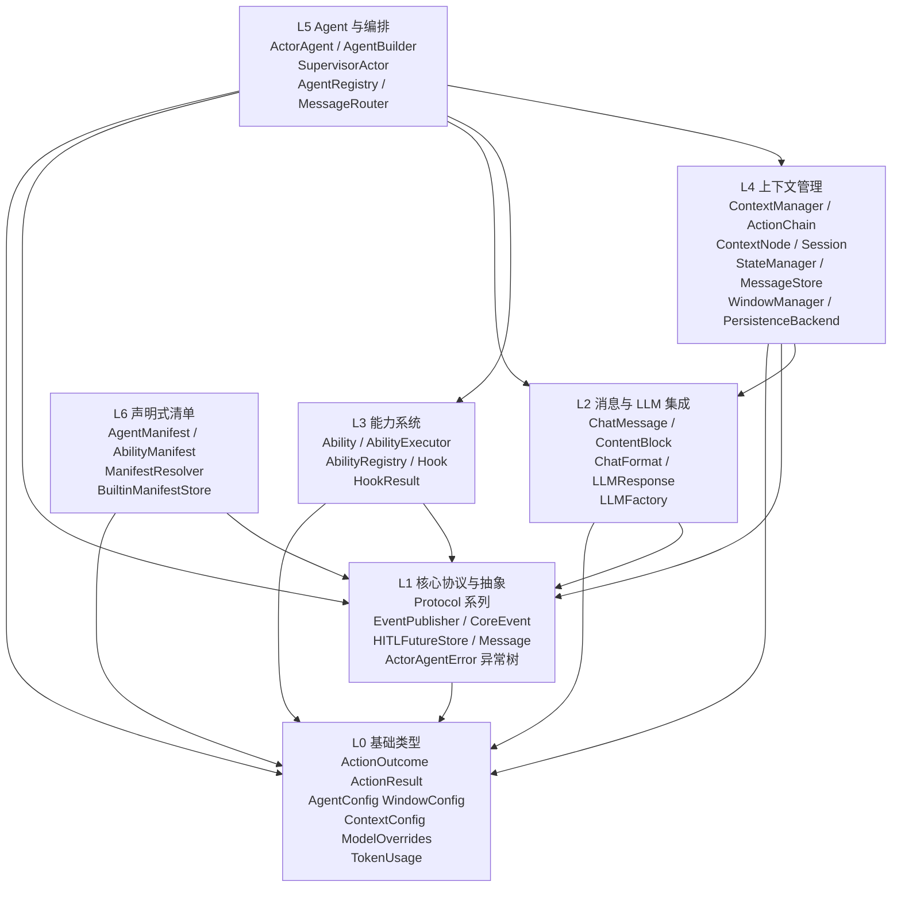

## `ghrah-core` 蓝图 v2 — 类关系导向

> **设计哲学**: <!-- 由维护者填写 -->

---

### L0 基础类型层

零内部依赖的叶子模块，供所有上层模块引用。

**核心类说明**:

- **ActionOutcome** — 能力执行结果枚举，驱动 Agent 循环的分支决策
- **ActionResult** — 能力执行结果容器，`outcome` 决定后续流程，`data` 携带返回值，`next_action_hint` 可引导 Agent 下一轮行为
- **TokenUsage** — LLM 调用 token 消耗追踪，支持 dict 序列化
- **WindowConfig** — 上下文窗口压缩策略配置，定义 token 预算和策略链
- **ModelOverrides** — LLM 模型参数覆盖，用于 Manifest 层面对模型行为的微调
- **ContextConfig** — 上下文管理器配置，控制持久化行为和快照策略；`command_sender` 字段用于远程执行场景
- **AgentConfig** — Agent 框架顶层配置，聚合 `WindowConfig`、`ContextConfig`、`ModelOverrides`，是 Agent 构建的唯一起点

**层间关系**: 被 L1~L6 所有层依赖，是整个框架的类型地基。

---

### L1 核心协议与抽象层

定义框架的核心协议（结构化子类型）、事件系统、异常层次、HITL 机制、进程间消息。

```mermaid
classDiagram
    class EventPublisher {
        <<ABC>>
        +publish(event: CoreEvent)*
    }
    class NullEventPublisher {
        +publish(event: CoreEvent)
    }
    class ServerEventPublisher {
        +publish(event: CoreEvent)
        -_create_event_message(event)
    }
    EventPublisher <|-- NullEventPublisher
    EventPublisher <|-- ServerEventPublisher
    ServerEventPublisher --> EventBus

    class CoreEvent {
        <<dataclass>>
        event_type: CoreEventType
        agent_name: str
        data: dict
    }
    class HITLRequestEvent {
        ability_name: str
        tool_call: dict
        context: dict
    }
    class AgentErrorEvent {
        error: str
    }
    class AgentResponseEvent {
        content: str
        content_blocks: list
        message_type: str
        metadata: dict
    }
    class ActionChainUpdatedEvent {
        node: dict
    }
    CoreEvent <|-- HITLRequestEvent
    CoreEvent <|-- AgentErrorEvent
    CoreEvent <|-- AgentResponseEvent
    CoreEvent <|-- ActionChainUpdatedEvent

    class HITLFutureStore {
        +create_future(agent, ability, tool_call_id) Future
        +resolve_future(agent, ability, tool_call_id, result)
        +get_future(agent, ability, tool_call_id) Future
        +cancel_future(...)
        +cancel_all()
        +list_pending()
    }

    class Message {
        <<dataclass>>
        sender: str
        recipient: str
        content: str
        type: MessageType
        id: str
        metadata: dict
        content_blocks: list
        +to_chat_message() ChatMessage
        +create_reply(content, type) Message
    }
    class MessageType {
        <<enum>>
        CHAT COMMAND TOOL_CALL
        TOOL_RESULT RESULT ERROR BROADCAST
    }
    Message --> MessageType

    class ActorAgentError {
        <<root exception>>
    }
    class AgentError {
        agent_name: str
    }
    class LLMError {
        provider: str
    }
    class ToolError {
        tool_name: str
    }
    class AbilityError {
        ability_name: str
    }
    class RegistryError
    class RoutingError
    class CommunicationTimeoutError {
        sender: str
        recipient: str
        timeout: float
    }
    ActorAgentError <|-- AgentError
    ActorAgentError <|-- LLMError
    ActorAgentError <|-- ToolError
    ActorAgentError <|-- AbilityError
    ActorAgentError <|-- RegistryError
    ActorAgentError <|-- RoutingError
    ActorAgentError <|-- CommunicationTimeoutError

    class AbilityProtocol {
        <<Protocol>>
        +name: str*
        +execute()*
        +bind_tool()*
        +get_hooks()*
        +get_default_state()*
    }
    class ExecutorProtocol {
        <<Protocol>>
        +execute_ability()*
        +execute_tool_calls()*
        +update_hooks()*
        +update_event_publisher()*
        +receive_hitl_response()*
    }
    class LLMProtocol {
        <<Protocol>>
        +model: str*
        +generate()*
        +configure_tools()*
        +apply_model_overrides()*
    }
    class CommandSender {
        <<Protocol>>
        +send_command()*
    }
    class SupervisorProtocol {
        <<Protocol>>
        +list_agents()*
        +terminate_agent()*
        +spawn_agent()*
        +send()*
        +broadcast()*
        +get_agent_handle()*
    }
```

**核心类说明**:

- **EventPublisher / NullEventPublisher / ServerEventPublisher** — 事件发布抽象与两种实现：NullEventPublisher 用于本地/测试模式（静默丢弃），ServerEventPublisher 通过 EventBus 向 Observer 连接推送事件
- **CoreEvent 体系** — 框架统一事件模型，子类型覆盖 HITL 请求、Agent 错误/响应、上下文链更新、会话生命周期等场景
- **HITLFutureStore** — Human-in-the-Loop 核心机制，以 `(agent, ability, tool_call_id)` 三元组为 key 管理 asyncio.Future，支撑能力执行中的审批/拒绝流程
- **Message / MessageType** — Agent 间通信的统一消息协议，支持从 Message 转换为 ChatMessage（LLM 格式）和创建回复
- **ActorAgentError 异常树** — 框架级根异常，所有业务异常均派生自此类，便于上层统一捕获框架错误；关键子类携带上下文信息（如 `agent_name`、`provider`、`sender/recipient`）
- **Protocol 系列** — 核心解耦机制。`AbilityProtocol` 解耦 Agent 与具体 Ability 实现；`ExecutorProtocol` 解耦 Agent 循环与执行策略（本地/远程）；`LLMProtocol` 解耦 Agent 与 LLM 提供商；`CommandSender` 解耦能力执行与服务端通信；`SupervisorProtocol` 解耦能力上下文与 Supervisor 实现

**层间关系**: 依赖 L0（types）；被 L2~L6 依赖，是框架的"契约层"。

---

### L2 消息与 LLM 集成层

将 LLM 厂商差异封装为统一的消息模型和格式适配器。

**核心类说明**:

- **ChatMessage** — 框架统一消息模型，以结构化的 `content_blocks` 列表替代纯文本，天然支持多模态和工具调用。提供 `system/user/ai/tool` 工厂方法和 `find_blocks` 类型查询
- **ContentBlock 系列** — 内容块类型联合体，每种块对应一种语义：文本、推理链、图像、音频、文件、工具调用、工具结果、错误、流式块。块通过 `type` 字段实现运行时多态
- **LLMResponse** — LLM 调用的统一响应容器，解耦厂商差异。持有 `content_blocks`、`token_usage`、`response_metadata`，可转换为 `ChatMessage` 继续上下文循环
- **ChatFormat / OpenAIFormat / AnthropicFormat / DeepSeekFormat** — 适配器模式，将 `ChatMessage` 列表转换为厂商 API 格式、将厂商响应解析为 `LLMResponse`。DeepSeek 继承 OpenAI 并覆盖推理内容提取
- **LLMFactory** — 从 `AgentConfig` 创建对应 `ChatFormat` 实例，懒加载厂商 SDK
- **ChatMessageFactory** — 默认 `MessageFactory` 协议实现，供 WindowManager 等模块构造消息和块

**层间关系**: 依赖 L0（TokenUsage、AgentConfig）和 L1（LLMProtocol）；被 L3（能力系统不需要直接依赖）、L4（上下文管理）和 L5（Agent 循环）依赖。

---

### L3 能力系统层

定义 Agent 的工具/能力抽象、执行策略、注册机制和 Hook 拦截。

**核心类说明**:

- **Ability** — 能力抽象基类，所有 Agent 工具必须实现 `execute`、`get_hooks` 接口。`bind_tool` 支持自引用以暴露 LLM tool schema；`get_default_state` 提供能力的初始状态
- **AbilityExecutionContext** — 能力执行的最小上下文，通过 Protocol 解耦：`ContextManagerProtocol` 提供状态管理，`SupervisorProtocol` 提供集群操作，不直接依赖具体实现
- **AbilityExecutor / LocalAbilityExecutor / RemoteAbilityExecutor** — 策略模式：`LocalAbilityExecutor` 在进程内执行能力并支持 HITL 审批流；`RemoteAbilityExecutor` 通过 `CommandSender` 将能力执行委托给 Subject 端
- **AbilityRegistry** — 进程级工厂注册表，将能力类型名映射到类，支持 `AgentManifest` 驱动的动态能力加载
- **Hook / HookPoint / HookResult** — 拦截器机制，`HookPoint` 定义 10 个触发点覆盖 Agent 循环的三层（action/LLM/tool），`HookResult` 通过 `continue_/stop/hitl/route` 控制执行流。这是框架扩展性的核心入口
- **BuiltinHookRegistry** — Hook 的类级注册表，与 AbilityRegistry 对称设计

**层间关系**: 依赖 L0（ActionResult）、L1（Protocol、HITL、Event、异常）；被 L5（Agent）直接依赖，L6（Manifest）通过 AbilityRegistry 间接使用。

---

### L4 上下文管理层

管理 Agent 的对话历史、状态、会话分支、窗口压缩和持久化——是 Agent 循环的"记忆系统"。

**核心类说明**:

- **ContextNode** — 不可变快照节点，类似 Git commit。持有 `messages_delta`（增量）或 `messages_snapshot`（全量），以及 `action_results`、`agent_state`、`branch_name`、`session_id`
- **Session** — 会话分支，支持 fork/checkout 语义。`is_rebase` 属性标识从其他 Agent 上下文变基而来的子代理会话
- **ActionChain** — 类 Git 的链式管理器，支持分支、fork、checkout、重建。`commit_node` 追加节点，`fork` 创建新分支，`checkout` 切换分支
- **StateManager** — 事务性状态管理器，支持嵌套 savepoint 和深拷贝隔离。`begin_transaction` / `commit` / `rollback` 确保能力执行失败时状态回滚
- **MessageStore** — 运行时消息存储，通过 `snapshot_interval` 控制快照频率，`compute_delta_since` 实现增量持久化
- **WindowStrategy / 策略系列** — 策略模式，4 种窗口压缩策略可组合：`TruncationStrategy`（截断最老消息）、`SlidingWindowStrategy`（滑动窗口）、`ToolCallFoldStrategy`（折叠长工具结果）、`LLMSummaryStrategy`（LLM 摘要）。由 `WindowManager` 按链式顺序组合
- **WindowManager** — 策略组合器，按配置顺序依次应用 `WindowStrategy`，实现 pipeline 式的窗口压缩
- **PersistenceBackend / 实现系列** — 持久化抽象与 4 种实现：InMemory（测试）、JsonFile（文件）、Sqlite（WAL 模式）、Remote（委托 Subject）。由 `create_persistence()` 工厂函数从 `ContextConfig` 创建
- **ContextManager** — 门面类，聚合 `ActionChain`、`StateManager`、`MessageStore`、`WindowManager`、`PersistenceBackend`，是 Agent 驱动循环操作上下文的唯一入口。`build_execution_context` 方法将自身转换为 `AbilityExecutionContext`（通过 Protocol），实现与能力系统的解耦

**层间关系**: 依赖 L0（types）、L1（Protocol）、L2（ChatMessage）；被 L5（ActorAgent）直接依赖。

---

### L5 Agent 与编排层

Agent 的核心驱动循环和多 Agent 编排机制。

**核心类说明**:

- **ActorAgent** — 框架中央枢纽，聚合 `ContextManager`、`AbilityExecutor`、`LLMProtocol`、`EventPublisher`，通过 `_drive_loop` 驱动"LLM 生成 → 工具调用 → 能力执行 → Hook 拦截 → 结果提交"循环。对外暴露 `chat`（同步入口）和 `receive`（消息入口），以及会话管理（create/switch/list/archive/delete）和 HITL 响应注入接口
- **AgentBuilder** — 零配置工厂，从 `AgentConfig` 构建完整 `ActorAgent`（含 ContextManager、WindowManager、LLM 实例化）
- **AgentRegistry** — 进程级 Agent 注册表，管理 `name → AgentInfo` 映射，供路由和查找
- **MessageRouter** — 消息路由器，支持点对点 `route` 和 `broadcast`，以及同步 `send_and_wait`（带超时）
- **SupervisorActor** — 多 Agent 生命期编排器，管理 Agent 的 spawn/terminate、消息路由、能力注入。实现 `SupervisorProtocol` 接口，是分布式场景下的中央协调节点

**层间关系**: 依赖 L0~L4 所有层；`communication` 模块被 L6 的 Manifest 系统间接使用（通过 AgentConfig 构建）。

---

### L6 声明式清单层

独立子系统，通过 YAML/JSON 声明式定义 Agent 和 Ability，解析后生成 `AgentConfig` 和能力注册表。

```mermaid
classDiagram
    class AbilityManifest {
        manifest: str
        version: str
        metadata: AbilityMetadata
        tool: ToolSchema
        implementation: ImplementationDef
        hooks: AbilityHooks | None
        +full_name: str
    }
    class AgentManifest {
        manifest: str
        version: str
        metadata: AgentMetadata
        model: ModelConfig | None
        system_prompt: str | None
        max_iterations: int
        communication_timeout: float
        description: str | None
        abilities: list~AbilityRef~
        context: ContextOverrides | None
        hooks: AgentHooks | None
        +full_name: str
    }
    class AbilityMetadata {
        namespace: str
        name: str
        title: str
        description: str
        tags: list
        permissions: PermissionFlags | None
    }
    class AgentMetadata {
        namespace: str
        name: str
        title: str
        description: str
    }
    class ToolSchema {
        name: str
        description: str
        parameters: list~ToolParameter~
        +to_openai_schema() dict
        +to_openai_tool() dict
    }
    class PermissionFlags {
        require_hitl: bool
        fs_read_only: bool
        fs_write: bool
        net_access: bool
        shell_access: bool
        allowed_paths: list
        denied_paths: list
        allowed_commands: list
        denied_commands: list
        +merge(other) PermissionFlags
    }
    class ImplementationDef {
        type: str
        handler: str | None
        entrypoint: str | None
        source: str | None
    }
    class AbilityRef {
        ref: str | None
        type: str | None
        permissions: PermissionFlags | None
    }
    class AbilityHooks {
        pre_execute: list~HookDef~
        post_execute: list~HookDef~
        on_error: list~HookDef~
    }
    class ModelConfig {
        agent_config_name: str | None
        temperature: float | None
        max_tokens: int | None
        top_p: float | None
        top_k: int | None
    }
    class ContextOverrides {
        window: WindowOverrides | None
        persistence: PersistenceOverrides | None
    }

    AbilityManifest --> AbilityMetadata
    AbilityManifest --> ToolSchema
    AbilityManifest --> ImplementationDef
    AbilityManifest --> AbilityHooks
    AgentManifest --> AgentMetadata
    AgentManifest --> ModelConfig
    AgentManifest --> AbilityRef
    AgentManifest --> ContextOverrides
    AgentManifest --> AgentHooks
    AbilityRef --> PermissionFlags
    ContextOverrides --> WindowOverrides
    ContextOverrides --> PersistenceOverrides

    class ManifestResolver {
        -_store: ManifestStoreProtocol
        +resolve(agent_manifest: AgentManifest) ResolvedAgent
        -_build_config(resolved, manifest) AgentConfig
        -_resolve_abilities(manifest) list~ResolvedAbility~
    }
    ManifestResolver --> ManifestStoreProtocol

    class ResolvedAbility {
        <<dataclass>>
        ability_name: str
        tool_schema: ToolSchema
        permissions: PermissionFlags
        implementation: ImplementationDef
        hooks: AbilityHooks | None
        +from_builtin(name)$ ResolvedAbility
    }
    class ResolvedAgent {
        <<dataclass>>
        config: AgentConfig
        abilities: list~ResolvedAbility~
    }
    ManifestResolver --> ResolvedAgent : produces
    ResolvedAgent --> AgentConfig
    ResolvedAgent --> ResolvedAbility

    class BuiltinManifestStore {
        +load_ability(name) AbilityManifest
        +load_agent(name) AgentManifest
        +list_abilities() list
        +list_agents() list
    }
    class ManifestStoreProtocol {
        <<Protocol>>
        +load_ability(name)*
        +load_agent(name)*
        +list_abilities()*
        +list_agents()*
    }
    BuiltinManifestStore ..|> ManifestStoreProtocol
```

**核心类说明**:

- **AbilityManifest / AgentManifest** — 声明式定义的核心数据模型（Pydantic BaseModel），包含元数据、工具 schema、实现引用、权限和 Hook 配置。`full_name` 属性返回 `namespace.name` 格式
- **PermissionFlags** — 能力权限声明，支持 `merge` 语义用于 Agent 级别覆盖 Ability 级别的权限
- **ToolSchema** — 工具的 JSON Schema 定义，可直接转换为 OpenAI function calling 格式
- **ManifestResolver** — 将 `AgentManifest` 解析为 `ResolvedAgent`（含 `AgentConfig` + `ResolvedAbility` 列表），是从声明式定义到运行时配置的桥梁
- **ResolvedAgent / ResolvedAbility** — 解析后的完整定义，可直接用于构建 `ActorAgent` 和注册能力
- **BuiltinManifestStore** — 内置 YAML 清单的加载器，实现 `ManifestStoreProtocol`

**层间关系**: 仅依赖 L0（AgentConfig 等配置类型）和 Pydantic/YAML；通过 `ManifestResolver._build_config` 将 Manifest 转换为 L0 的 `AgentConfig`，连接声明式与运行时。

---

### 层间依赖总图

**关键依赖路径**:
- L0 被所有层依赖，是框架的纯数据地基
- L1 的 Protocol 机制是跨层解耦的核心（`AbilityProtocol`、`ExecutorProtocol`、`LLMProtocol`、`CommandSender`、`SupervisorProtocol`）
- L5 `ActorAgent` 是唯一聚合所有层的"中枢"，但其对 L3/L4 的依赖通过 Protocol 实现可替换
- L6 完全自包含，仅通过 `ManifestResolver._build_config` 连接到 L0 的 `AgentConfig`